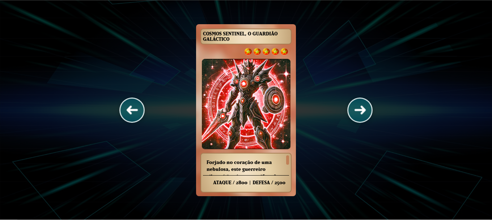

<h2 id="sobre-o-projeto">1. 🎮 Sobre o Projeto</h2>


[](https://github.com/Domisnnet/Shadow-Flip-Angular/blob/main/LICENSE)



**Shadow-Flip-Angular** é um jogo da memória inspirado em Yu-Gi-Oh!, desenvolvido com Angular e Angular CLI. Pode ser usado para criar interfaces dinâmicas e altamente escaláveis.

> 💡 Uma combinação entre **arquitetura moderna Angular** e **nostalgia dos duelos de cartas**.

---

## 📚 Tabela de Conteúdo

| 🎮 O Jogo | 🛠️ Técnico | 🤝 Comunidade |
| :---: | :---: | :---: |
| [](#sobre-o-projeto) | [](#5-instalação-e-execução-local) | [](#codigo-fonte) |
| [](#2-tecnologias-utilizadas) | [](#implantacao) | [](#creditos) |
| [](#3-como-jogar) | [](#como-contribuir) | [](#licenca) |
| [](#4-regras-do-jogo) | [](#perguntas-frequentes) | [](#conclusao) |

---

<h2 id="2-tecnologias-utilizadas">2. ⚙️ Tecnologias Utilizadas</h2>

| Camada | Tecnologias | Descrição |
| :--- | :--- | :--- |
| **Frontend** |   | Framework robusto com tipagem forte e arquitetura modular. |
| **Arquitetura** |  | Programação reativa e gerenciamento de estado. |

---

<h2 id="3-como-jogar">3. 🚀 Como Jogar</h2>

| Passo | Ação |
| :---: | :--- |
| **1** | Acesse um dos links na seção de implantação. |
| **2** | Clique em uma carta para revelá-la. |
| **3** | Encontre o par correspondente para marcar pontos. |
| **4** | Complete o tabuleiro para vencer o duelo! |

---

<h2 id="4-regras-do-jogo">4. 🧩 Regras do Jogo</h2>

* 🔹 **Virar:** Clique em uma carta para virá-la.
* 🔹 **Match:** Se as cartas coincidirem, permanecem viradas.
* 🔹 **Erro:** Caso contrário, voltam à posição inicial após 1 segundo.
* 🏆 **Vitória:** O jogo termina quando todos os pares forem encontrados.

---

<h2 id="5-instalação-e-execução-local">5. 🛠️ Instalação e Execução Local</h2>

```bash
# Clone o repositório
git clone https://github.com/Domisnnet/Shadow-Flip-Angular.git

# Instale e rode
cd Shadow-Flip-Angular
npm install
ng serve

# 💻 Execução Local

O jogo ficará disponível em http://localhost:4200(http://localhost:4200)
> ⚠️ Observação: a porta pode variar dependendo do ambiente.
```

---

<h2 id="implantacao">6. 🌐 Implantação</h2>

O projeto está disponível para jogar online nos seguinte link:

| Plataforma | Status | Link de Acesso direto para o Jogo: |
| :--- | :---: | :--- |
| **GitHub Pages** |  | [](https://studio-8738608268-935f4.web.app/)

---

<h2 id="como-contribuir">7. 🤝 Contribuindo para o Projeto</h2>

Adicione este projeto ao seu "deck" de desenvolvedor!  
“O coração das cartas também guia os contribuidores!” 🃏

| Fase | Ação | Link / Comando |
| :---: | :--- | :--- |
| **01** | **Fork** | [](https://github.com/Domisnnet/Shadow-Flip-Angular/fork) |
| **02** | **Branch** | `git checkout -b feature/MinhaMelhoria` |
| **03** | **Commit** | `git commit -m 'feat: nova seção de álbuns'` |
| **04** | **Push** | `git push origin feature/MinhaMelhoria` |
| **05** | **PR** | [](https://github.com/Domisnnet/Shadow-Flip-Angular/compare) 

### 🐛 Encontrou um problema?

[](https://github.com/Domisnnet/Shadow-Flip-Angular/issues)
[](https://github.com/Domisnnet/Shadow-Flip-Angular/issues/new) 

---

<h2 id="perguntas-frequentes">8. 🧠 Perguntas Frequentes</h2>

<details>
<summary><strong>O que é o Shadow-Flip-Angular ❓</strong></summary>
<p>🃏 <strong>Resposta:</strong> É um jogo de cartas da memória inspirado em Yu-Gi-Oh!, desenvolvido com Angular moderno para demonstrar arquitetura e performance.</p>
</details>

<details>
<summary><strong>É possível jogar online ❓</strong></summary>
<p>✅ <strong>Sim!</strong> O jogo está disponível via Firebase na seção de implantação.</p>
</details>

<details>
<summary><strong>Como gerar build de produção ❓</strong></summary>
<p>Execute <code>ng build</code>. Os arquivos serão gerados na pasta <code>dist/</code>.</p>
</details>

<details>
<summary><strong>Posso contribuir ❓</strong></summary>
<p>Sim! Basta seguir o guia acima e abrir um Pull Request 🚀</p>
</details>

---

<h2 id="codigo-fonte">9. 💻 Código Fonte</h2>

Gostou do jogo? Explore o código:

[](https://domisnnet.github.io/Shadow-Flip-Angular/)


---

<h2 id="creditos">10. 📝 Créditos</h2>

* **Desenvolvedor 👨‍💻: DomisDev**

---

<h2 id="licenca">11. 📄 Licença</h2>

Este projeto é open source e está licenciado sob a licença MIT.

---

<h2 id="conclusao">12. 📝 Conclusão e Perfil</h2>

O **Shadow-Flip-Angular** combina arquitetura moderna, performance e interatividade.

Explore, contribua e evolua este duelo digital!

✨ *“Cada carta virada é uma jogada do destino.”*

---

Para conhecer meu Repositório:

<a href="https://github.com/Domisnnet"> 
   
</a>
